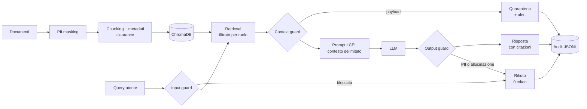

# 🛡️ Secure Insurance RAG AI

PoC di **RAG sicuro su documentazione assicurativa**. Il retrieval-augmented generation è la parte
facile: quello che rende un sistema del genere utilizzabile in una compagnia assicurativa è ciò che
sta attorno — anonimizzazione dei dati personali prima che lascino il perimetro, difesa contro la
prompt injection (inclusa quella nascosta nei documenti), controllo degli accessi sui vettori e un
audit trail ricostruibile.

> ⚠️ I documenti in `data/policies/` sono **interamente sintetici**. Nomi, codici fiscali, IBAN e
> partite IVA sono inventati e non riferibili a persone o aziende reali.

## Cosa dimostra

| | Capacità | Dove guardarla |
| :--- | :--- | :--- |
| 🔒 | **PII masking prima dell'embedding**: nel vector store non esiste un CF o un IBAN in chiaro. Segnaposto stabili tra documenti (`[IBAN_001]`). | `secure-rag ingest` |
| 🚫 | **Prompt injection diretta** bloccata prima della chiamata al modello: 0 ms, 0 token. | scenario 2 |
| 🧨 | **Prompt injection indiretta** nascosta in un commento HTML dentro una perizia: il chunk finisce in quarantena e l'evento viene segnalato. | scenario 3 |
| 👤 | **RBAC sui vettori**: la stessa domanda dà risultati diversi per un agente di rete e per la direzione. | scenari 5 e 6 |
| 📋 | **Audit trail** JSONL con hash della domanda (mai il testo), fonti, quarantene e verdetti dei guard. | `secure-rag audit` |
| 🔌 | **Provider intercambiabile**: OpenAI, Azure OpenAI, Ollama on-premise, o `fake` per girare offline. | `.env` |

## Quickstart

```bash
uv venv --python 3.12
uv pip install -e ".[dev]"
cp .env.example .env          # funziona già così: LLM_PROVIDER=fake, nessuna API key richiesta

.venv/bin/secure-rag ingest         # anonimizza e indicizza
.venv/bin/secure-rag attack-demo    # i sei scenari di sicurezza
.venv/bin/streamlit run app/streamlit_app.py
```

Per usare un modello reale, in `.env`: `LLM_PROVIDER=openai` e `OPENAI_API_KEY=…` (oppure `azure` /
`ollama`). Cambiando provider di embedding va rieseguito `ingest`, perché cambia la dimensione dei
vettori.

Demo guidata completa: `bash scripts/demo.sh`. Test: `.venv/bin/pytest -q` (32 test, tutti offline).

## Architettura



Dettaglio dei quattro layer, del flusso passo per passo e dei punti di estensione verso
un'architettura enterprise: **[docs/ARCHITECTURE.md](docs/ARCHITECTURE.md)**.

## Sicurezza: cosa è mitigato e cosa no

| Rischio OWASP LLM | Mitigazione | File |
| :--- | :--- | :--- |
| LLM01 — Prompt Injection diretta | Input guard a pattern, blocco pre-modello | `security/guardrails.py` |
| LLM01 — Prompt Injection indiretta | Scansione dei chunk recuperati + delimitatori rigidi nel prompt | `security/guardrails.py`, `rag.py` |
| LLM04 — Denial of Service | Limite di lunghezza query, `k` di retrieval fisso | `security/guardrails.py` |
| LLM06 — Sensitive Information Disclosure | Masking pre-embedding, RBAC sul retrieval, output guard, audit senza query in chiaro | `security/pii.py`, `vectorstore.py`, `security/audit.py` |
| LLM08 — Excessive Agency | Sistema read-only: il modello non compie azioni | architettura |
| LLM09 — Overreliance | `temperature=0`, obbligo di citazione, formula di non-risposta, controllo di groundedness | `rag.py`, `security/guardrails.py` |

I limiti sono dichiarati esplicitamente — guardrail a regole eludibili con riformulazioni, PII a
regex che non copre i nomi in contesto libero, nessuna autenticazione reale, groundedness misurata
in modo lessicale: **[docs/SECURITY.md](docs/SECURITY.md)**.

## Struttura

```
src/secure_rag/
├── config.py              impostazioni da .env
├── providers.py           factory LLM/embeddings (openai | azure | ollama | fake)
├── ingestion.py           load → mask → chunk → metadati di clearance
├── vectorstore.py         ChromaDB + filtro RBAC sul retrieval
├── rag.py                 pipeline con i sette passi di controllo
├── cli.py                 ingest · ask · attack-demo · audit
└── security/
    ├── pii.py             masking con segnaposto stabili + vault
    ├── guardrails.py      input guard · context guard · output guard
    └── audit.py           audit trail JSONL

app/streamlit_app.py       UI demo con pannello di sicurezza
data/policies/             4 documenti sintetici, uno deliberatamente compromesso
tests/                     32 test, nessuna chiamata di rete
```

## Documentazione

- **[docs/ARCHITECTURE.md](docs/ARCHITECTURE.md)** — i quattro layer, il flusso di una richiesta, i punti di estensione
- **[docs/SECURITY.md](docs/SECURITY.md)** — threat model, mapping OWASP Top 10 for LLM, limiti dichiarati
- **[docs/DECISIONS.md](docs/DECISIONS.md)** — ADR: perché il masking a monte, perché i guard fuori dalla catena, perché chunk da 800
- **[ROADMAP.md](ROADMAP.md)** — cosa manca e con quale sforzo (Presidio, LangGraph, hybrid search, Qdrant…)

## Stack

Python 3.12 · LangChain (LCEL) · ChromaDB · Streamlit · pydantic-settings · pytest · uv
