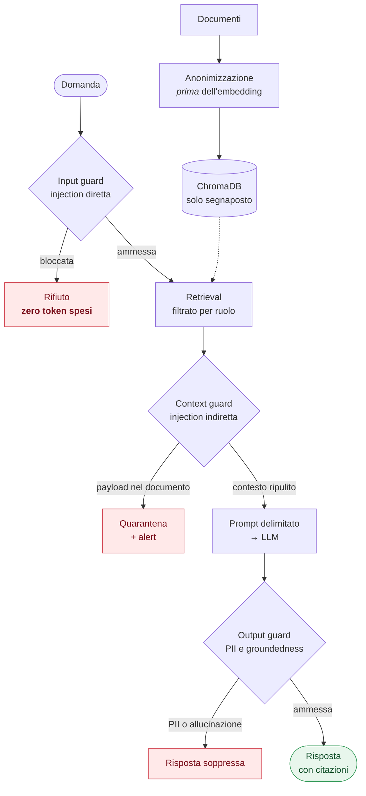

# 🛡️ Secure Insurance RAG AI

### ▶ [Prova l'istanza pubblica → insurag.aicorelabs.io](https://insurag.aicorelabs.io)

Nessuna installazione. Il percorso più breve per capire cosa fa: premi la domanda pronta **«Margine
di trattativa»** prima come *Agente di rete*, poi come *Direzione Sinistri*. È la stessa domanda, e
la risposta cambia — perché il controllo degli accessi agisce sul **retrieval**, non sul testo
generato: il documento riservato non entra proprio nel prompt.

Poi apri la scheda **🛡️ Sicurezza** e lancia lo scenario di *prompt injection indiretta*:
un'istruzione nascosta dentro una perizia, che il sistema mette in quarantena e dichiara nella
risposta invece di eseguirla.

> L'istanza pubblica ha limiti di frequenza attivi e serve documenti sintetici. Raggiunto il tetto
> giornaliero non smette di funzionare: passa al motore deterministico offline.

---

PoC di **RAG sicuro su documentazione assicurativa**. Il retrieval-augmented generation è la parte
facile: quello che rende un sistema del genere utilizzabile in una compagnia assicurativa è ciò che
sta attorno — anonimizzazione dei dati personali prima che lascino il perimetro, difesa contro la
prompt injection (inclusa quella nascosta nei documenti), controllo degli accessi sui vettori e un
audit trail ricostruibile.

> ⚠️ I documenti in `data/policies/` sono **interamente sintetici**. Nomi, codici fiscali, IBAN e
> partite IVA sono inventati e non riferibili a persone o aziende reali.

## Cosa dimostra

| | Capacità | Dove guardarla |
| :--- | :--- | :--- |
| 🔒 | **PII masking prima dell'embedding**: nel vector store non esiste un CF o un IBAN in chiaro. Copre anche gli identificativi *indiretti* dell'elenco GDPR — numero di polizza, sinistro, targa, telaio — con segnaposto stabili fra documenti (`[IBAN_001]`). | `secure-rag ingest` |
| 🧠 | **Anonimizzazione a due livelli**: regex deterministiche sui formati rigidi, e **Microsoft Presidio** con un NER italiano sui nomi in *testo libero* — «il testimone Andrea Gallo ha dichiarato», che nessun pattern può vedere. Attivi entrambi sull'istanza pubblica; il secondo è opzionale nell'installazione da sorgente. | `security/ner.py` |
| 🚫 | **Prompt injection diretta** bloccata prima della chiamata al modello: 0 ms, 0 token. | scenario 2 |
| 🧨 | **Prompt injection indiretta** nascosta in un commento HTML dentro una perizia: il chunk finisce in quarantena e l'evento viene segnalato. | scenario 3 |
| 👤 | **RBAC sui vettori**: la stessa domanda dà risultati diversi per un agente di rete e per la direzione. | scenari 5 e 6 |
| 📋 | **Audit trail** JSONL con hash della domanda (mai il testo), fonti, quarantene e verdetti dei guard. | `secure-rag audit` |
| 🔌 | **Provider intercambiabile**: OpenAI, Azure OpenAI, Ollama on-premise, o `fake` per girare offline. | `.env` |
| 📎 | **Upload di documenti in chat** con referto di sicurezza immediato: PII rimosse, confronto prima/dopo e rilevamento di istruzioni nascoste, prima ancora della prima domanda. | scheda **Documenti** |
| ⏱️ | **Limiti di frequenza** sull'istanza pubblica: quota per visitatore e tetto di spesa giornaliero che **degrada al motore offline** invece di rifiutare le richieste. | `security/ratelimit.py` |

## L'interfaccia

Tre schede, pensate per essere proiettate durante una discussione tecnica:

- **💬 Chat** — domande sul corpus aziendale, sui soli documenti caricati, o su entrambi. Ogni
  risposta mostra ruolo, ambito, latenza, eventi di sicurezza e fonti (📄 corpus, 📎 caricato).
- **📎 Documenti** — caricamento di PDF/MD/TXT con **referto di sicurezza**: quante PII sono state
  rimosse e di che tipo, confronto affiancato fra testo originale e testo anonimizzato (è il
  secondo che viene indicizzato e inviato all'LLM), e segnalazione dei blocchi che contengono
  istruzioni rivolte all'assistente.
- **🛡️ Sicurezza** — i sei scenari di attacco eseguibili con un clic, i **livelli di anonimizzazione
  attivi** su quell'istanza e l'audit trail in tabella.

I documenti caricati vivono in una **collection separata e isolata per sessione**, con clearance
ereditata dal ruolo attivo: non contaminano il corpus aziendale, non sono raggiungibili dagli altri
visitatori, e un file caricato da un utente `management` resta invisibile a un `agent`. Togliendo un
file dall'elenco i suoi chunk vengono eliminati dall'indice — ciò che l'interfaccia mostra e ciò che
il retrieval può raggiungere devono coincidere.

## Quickstart

```bash
uv venv --python 3.12
uv pip install -e ".[dev]"
cp .env.example .env          # opzionale: aggiungi OPENAI_API_KEY per usare il modello in rete

.venv/bin/secure-rag ingest         # anonimizza e indicizza
.venv/bin/secure-rag ask "Qual è la franchigia della sezione cyber?"
.venv/bin/secure-rag attack-demo    # i sei scenari di sicurezza
.venv/bin/streamlit run app/streamlit_app.py
```

### Scelta del modello all'avvio

I comandi che usano un LLM aprono un menu con i provider **effettivamente disponibili** sulla
macchina:

```
  ● 1) OpenAI (in rete)             (predefinito)
      gpt-4o-mini · embeddings text-embedding-3-small
  ○ 2) Ollama (locale, on-premise)  non disponibile
      ↳ servizio non raggiungibile su http://localhost:11434 — installa Ollama da ollama.com,
        poi: ollama pull llama3.1 && ollama pull nomic-embed-text
  ● 3) Offline deterministico
      nessuna rete, nessun token consumato — usato dai test
```

Per saltarlo: `--provider openai|ollama|fake` oppure `--no-prompt` (usa il valore di `.env`). Il
menu non compare quando lo standard input non è un terminale, così script e CI restano
deterministici.

**Ogni provider ha il proprio indice** (`chroma_db/openai__text-embedding-3-small`,
`chroma_db/fake__deterministic-256`, …), perché i modelli di embedding producono vettori di
dimensione diversa: 1536 per `text-embedding-3-small`, 256 per quello deterministico. Passando a un
provider nuovo va eseguito `ingest` una volta per quel provider; gli indici già costruiti restano
validi e si può alternare senza re-indicizzare.

Demo guidata: `bash scripts/demo.sh openai` (o `fake`). Test: `.venv/bin/pytest -q` — 137 test, tutti
offline, nessuna API key richiesta.

## Architettura



Ogni esito — risposta, rifiuto o quarantena — finisce nell'**audit trail**.

Dettaglio dei quattro layer, del flusso passo per passo e dei punti di estensione verso
un'architettura enterprise: **[docs/ARCHITECTURE.md](docs/ARCHITECTURE.md)**.

## Sicurezza: cosa è mitigato e cosa no

| Rischio OWASP LLM | Mitigazione | File |
| :--- | :--- | :--- |
| LLM01 — Prompt Injection diretta | Input guard a pattern, blocco pre-modello | `security/guardrails.py` |
| LLM01 — Prompt Injection indiretta | Scansione dei chunk recuperati + delimitatori rigidi nel prompt | `security/guardrails.py`, `rag.py` |
| LLM04 — Denial of Service | Limite di lunghezza query, `k` di retrieval fisso | `security/guardrails.py` |
| LLM06 — Sensitive Information Disclosure | Masking pre-embedding a due livelli, regex + NER, entrambi attivi in produzione; RBAC sul retrieval, output guard, audit senza query in chiaro | `security/pii.py`, `security/ner.py`, `vectorstore.py`, `security/audit.py` |
| LLM08 — Excessive Agency | Sistema read-only: il modello non compie azioni | architettura |
| LLM09 — Overreliance | `temperature=0`, obbligo di citazione, formula di non-risposta, controllo di groundedness | `rag.py`, `security/guardrails.py` |

I limiti sono dichiarati esplicitamente — guardrail a regole eludibili con riformulazioni, dati
sanitari e giudiziari che nessuno dei due livelli di anonimizzazione può vedere, nessuna
autenticazione reale, groundedness misurata in modo lessicale:
**[docs/SECURITY.md](docs/SECURITY.md)**.

### Attivare il livello 2 in locale

Sull'istanza pubblica è già attivo: il modello è nell'immagine Docker. In un'installazione da
sorgente è spento, perché 540 MB romperebbero la promessa di una demo installabile in un minuto:

```bash
uv pip install -e ".[presidio]"
.venv/bin/python -m spacy download it_core_news_lg   # ~540 MB, ~870 MB di RAM a regime
PII_NER_ENABLED=true .venv/bin/secure-rag ingest
```

Senza la libreria o senza il modello il sistema torna alle sole regex **dicendolo** — nella riga di
esito dell'ingest e nella scheda 🛡️ Sicurezza — invece di far credere di aver mascherato di più. E
il modello non viene **mai** scaricato da solo: un flag di configurazione non deve poter innescare un
download da centinaia di MB.

Cambiare il flag comporta un nuovo `ingest`, e il sistema **se ne accorge da sé**: l'indice porta una
marca con i livelli usati per costruirlo, e all'avvio viene rifatto se non coincidono con quelli
configurati. Un indice con segnaposto di livello 1 mentre l'interfaccia dichiara il livello 2 sarebbe
un'incoerenza silenziosa fra ciò che il sistema afferma e ciò che il retrieval contiene.

## Struttura

```
src/secure_rag/
├── config.py              impostazioni da .env
├── providers.py           factory LLM/embeddings (openai | azure | ollama | fake)
├── ingestion.py           load → mask → chunk → metadati di clearance
├── uploads.py             file caricati in sessione: limiti, masking, referto di sicurezza
├── vectorstore.py         ChromaDB + filtro RBAC sul retrieval
├── rag.py                 pipeline con i sette passi di controllo
├── cli.py                 ingest · ask · attack-demo · audit
└── security/
    ├── pii.py             livello 1: masking a regex, segnaposto stabili, categorie GDPR
    ├── ner.py             livello 2: Presidio + NER italiano, opzionale con fallback
    ├── vault.py           mappa segnaposto → valore reale, cifrata e opzionale
    ├── guardrails.py      input guard · context guard · output guard
    ├── ratelimit.py       quota per visitatore e tetto di spesa (istanza pubblica)
    └── audit.py           audit trail JSONL

app/streamlit_app.py       UI demo a schede: chat, upload documenti, sicurezza
data/policies/             4 documenti sintetici, uno deliberatamente compromesso
tests/                     137 test, nessuna chiamata di rete
```

## Deploy

L'istanza pubblica gira in container dietro un reverse proxy con TLS:

```bash
cp .env.example .env      # provider, API key e limiti di frequenza
docker compose up -d --build
```

Al primo avvio il container indicizza il corpus (anonimizzazione a due livelli inclusa) e lo conserva
su un volume, così i riavvii successivi non ripagano gli embedding — a meno che il livello di
anonimizzazione configurato non coincida con quello registrato nell'indice, nel qual caso viene
rifatto. La porta è pubblicata **solo su loopback**: l'unico percorso verso l'applicazione passa dal
proxy, ed è ciò che rende attendibile l'header `X-Forwarded-For` su cui si basano i limiti di
frequenza.

Procedura completa, configurazione del proxy e problemi frequenti: **[docs/DEPLOY.md](docs/DEPLOY.md)**.

## Documentazione

- **[docs/ARCHITECTURE.md](docs/ARCHITECTURE.md)** — i quattro layer, il flusso di una richiesta, i punti di estensione
- **[docs/SECURITY.md](docs/SECURITY.md)** — threat model, mapping OWASP Top 10 for LLM, limiti dichiarati
- **[docs/DECISIONS.md](docs/DECISIONS.md)** — ADR: perché il masking a monte, perché i guard fuori dalla catena, perché il NER è affiancato alle regex e non le sostituisce, perché l'indice dichiara con cosa è stato costruito, perché al tetto di spesa si degrada invece di bloccare
- **[docs/DEPLOY.md](docs/DEPLOY.md)** — pubblicazione in container dietro reverse proxy
- **[ROADMAP.md](ROADMAP.md)** — cosa manca e con quale sforzo (LLM locale per i dati sanitari, hybrid search, LangGraph, Qdrant…)

## Stack

Python 3.12 · LangChain (LCEL) · ChromaDB · **Microsoft Presidio + spaCy** · Streamlit ·
pydantic-settings · pytest · uv · Docker

Presidio e `cryptography` sono extra di `pyproject.toml` (`.[presidio]`, `.[vault]`): nell'immagine
Docker sono installati, in un'ambiente da sorgente si aggiungono quando servono.
