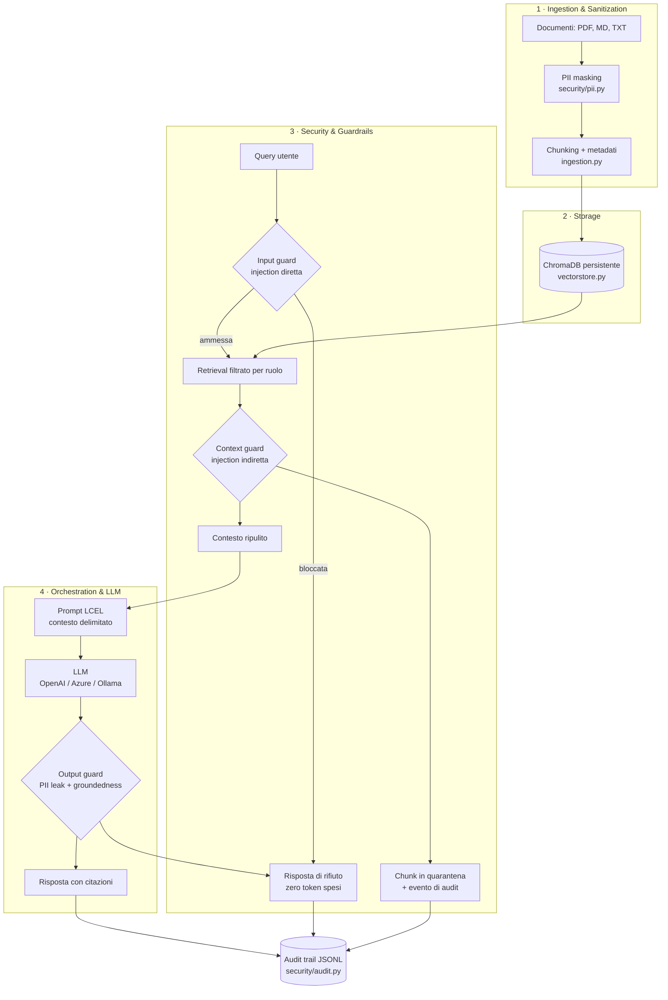

# Architettura

## I quattro layer

## Flusso di una richiesta, passo per passo

| # | Passo | File | Cosa impedisce |
| :--- | :--- | :--- | :--- |
| 1 | Input guard | `security/guardrails.py` | Prompt injection diretta, jailbreak, tentativi di esfiltrazione. Blocca **prima** della chiamata al modello: una richiesta malevola non costa token. |
| 2 | Retrieval con RBAC | `vectorstore.py` | Accesso a documenti fuori dal livello di clearance del richiedente. Il filtro è nella query al vector store, non a valle. |
| 3 | Context guard | `security/guardrails.py` | Prompt injection **indiretta**: istruzioni nascoste dentro i documenti indicizzati. |
| 4 | PII guard sul contesto | `security/pii.py` | Rete di sicurezza: se un documento sfugge all'anonimizzazione in ingestion, viene mascherato comunque prima del prompt. |
| 5 | Catena LCEL | `rag.py` | Allucinazioni: system prompt con delimitatori rigidi, obbligo di citare la fonte, `temperature=0`. |
| 6 | Output guard | `security/guardrails.py` | Fuga di dati personali in risposta e risposte non ancorate al contesto. |
| 7 | Audit | `security/audit.py` | Impossibilità di ricostruire a posteriori chi ha chiesto cosa e quali controlli sono scattati. |

## Perché il middleware di sicurezza è fuori dalla catena LCEL

La catena LangChain (`prompt | llm | parser`) è deliberatamente ridotta al solo passo di
generazione. I controlli stanno attorno, in codice Python esplicito, per tre ragioni:

1. **Interruzione anticipata.** Un input malevolo deve essere fermato prima che la catena parta.
   Se il guard fosse un anello della catena, la richiesta sarebbe già in volo.
2. **Testabilità.** Ogni guard è una funzione pura con input e output tipizzati: si testa senza
   mock dell'LLM (vedi `tests/test_guardrails.py`).
3. **Auditabilità.** I verdetti sono oggetti (`GuardVerdict`) con regola e motivazione, non booleani:
   è ciò che rende l'audit trail leggibile da un revisore.

## Modello RBAC

Tre livelli gerarchici, dichiarati nel front matter di ogni documento:

| Livello | Chi | Documenti visibili |
| :--- | :--- | :--- |
| `public` | Cliente | RC professionale |
| `agent` | Agente di rete | + polizza multirischio, perizie |
| `management` | Direzione Sinistri | + circolari interne con soglie e margini negoziali |

Il retriever costruisce un filtro `{"clearance": {"$in": [...]}}` sui metadati. Il chunk non
autorizzato non viene recuperato, quindi non entra nel prompt e non può essere rivelato nemmeno da
un attacco riuscito sul modello.

## Punti di estensione (dove si aggancia l'architettura enterprise)

| Componente PoC | Sostituto in produzione | Aggancio |
| :--- | :--- | :--- |
| Regex PII | **Microsoft Presidio** (NER + riconoscitori italiani) | Stessa firma `PIIMasker.mask(text) -> MaskingResult` |
| Guardrails a regole | **NeMo Guardrails** / **Guardrails AI** + classificatore di injection | Stesse firme `validate_input` / `scan_context` / `validate_output` |
| ChromaDB locale | **Qdrant**, **pgvector**, Azure AI Search | Solo `vectorstore.py`: il resto usa l'interfaccia `VectorStoreRetriever` |
| OpenAI pubblico | **Azure OpenAI** (già implementato, va solo configurato) | `providers.py`, variabili `AZURE_*` |
| Retrieval vettoriale puro | **Hybrid search** BM25 + re-ranking con cross-encoder | `vectorstore.get_retriever` |
| Catena lineare | **LangGraph** con human-in-the-loop per l'approvazione sinistri | Sostituisce `SecureRAGPipeline.answer` |
| Audit su file | Export verso **SIEM** (Splunk, Sentinel) + **LangSmith** per il tracing | `security/audit.py`, variabili `LANGCHAIN_*` |
