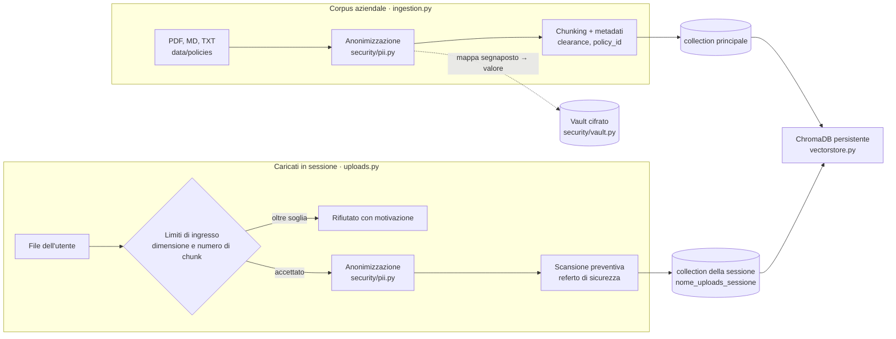
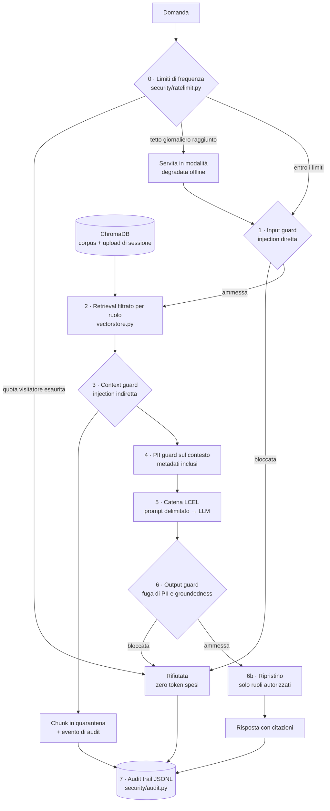

# Architettura

> **Cosa gira oggi in produzione.** La generazione usa **OpenAI `gpt-4o-mini`**, un modello esterno.
> Il percorso on-premise è implementato in `providers.py` (Ollama, Azure OpenAI) ma non è attivo: la
> VPS che ospita l'istanza pubblica non ha risorse per un modello locale. L'**anonimizzazione**, che
> è la parte che tratta dati in chiaro, gira invece **interamente in locale** con regex
> deterministiche — non esce dal perimetro nemmeno oggi. Si veda ADR-019 per l'architettura a tre
> livelli verso cui questo evolve.

## Due percorsi di indicizzazione

I documenti entrano nell'indice da due strade, che ricevono lo stesso trattamento di sicurezza ma
finiscono in **collection separate**.

**L'anonimizzazione precede l'embedding, sempre.** Nel vector store non esiste un codice fiscale in
chiaro: se l'indice venisse esfiltrato, conterrebbe segnaposto. È il motivo per cui l'ordine dei passi
non è negoziabile.

**Perché gli upload stanno in una collection per sessione.** Tenerli fuori dalla collection
principale evita che contaminino il corpus aziendale; separarli **anche per sessione** evita che il
documento di un visitatore diventi leggibile dagli altri. Su un'istanza pubblica la sola clearance
non basterebbe: due visitatori con lo stesso ruolo si vedrebbero i file a vicenda (ADR-015).

**Il referto di sicurezza arriva prima della prima domanda.** L'utente vede subito quante PII sono
state rimosse e se il documento contiene istruzioni rivolte all'assistente, invece di scoprirlo dalla
risposta. I chunk sospetti vengono comunque indicizzati e marcati: il context guard li fermerà a
runtime, perché un documento manomesso è un incidente da rendere visibile, non da far sparire.

## Il percorso di una richiesta

### Passo per passo

| # | Passo | File | Cosa impedisce |
| :--- | :--- | :--- | :--- |
| 0 | Limiti di frequenza | `security/ratelimit.py` | Abuso economico e saturazione su un'istanza esposta (OWASP **LLM04**). Applicato dall'entry point, non dalla pipeline. |
| 1 | Input guard | `security/guardrails.py` | Prompt injection diretta, jailbreak, esfiltrazione. Blocca **prima** della chiamata al modello: una richiesta malevola non costa token. |
| 2 | Retrieval con RBAC | `vectorstore.py` | Accesso a documenti fuori dal livello di clearance. Il filtro è nella query al vector store, non a valle. |
| 3 | Context guard | `security/guardrails.py` | Prompt injection **indiretta**: istruzioni nascoste nei documenti indicizzati o caricati. |
| 4 | PII guard sul contesto | `security/pii.py` | Rete di sicurezza sui chunk, **e mascheramento dei metadati**: il numero di polizza vive lì e non passa dall'anonimizzazione dell'ingestion. |
| 5 | Catena LCEL | `rag.py` | Allucinazioni: delimitatori rigidi, obbligo di citare la fonte, `temperature=0`. |
| 6 | Output guard | `security/guardrails.py` | Fuga di dati personali in risposta e risposte non ancorate al contesto. |
| 6b | Ripristino | `rag.py`, `security/vault.py` | Nulla: è un passo di usabilità, non di sicurezza. Attivo solo con vault configurato e per i ruoli in `UNMASK_ROLES`. |
| 7 | Audit | `security/audit.py` | Impossibilità di ricostruire chi ha chiesto cosa e quali controlli sono scattati. |

**Perché il ripristino sta dopo l'output guard, e non prima.** L'ordine sembra sbagliato e invece è
il punto: il guard verifica che il modello non abbia **rigenerato per conto suo** dati personali che
non gli erano stati forniti. Ripristinare a monte glielo farebbe scattare addosso ai segnaposto che
abbiamo sostituito noi — bloccando risposte legittime e, soprattutto, nascondendo il caso vero.

## Perché il middleware di sicurezza è fuori dalla catena LCEL

La catena LangChain (`prompt | llm | parser`) è deliberatamente ridotta al solo passo di
generazione. I controlli stanno attorno, in codice Python esplicito, per tre ragioni:

1. **Interruzione anticipata.** Un input malevolo deve essere fermato prima che la catena parta.
   Se il guard fosse un anello della catena, la richiesta sarebbe già in volo.
2. **Testabilità.** Ogni guard è una funzione pura con input e output tipizzati: si testa senza
   mock dell'LLM (vedi `tests/test_guardrails.py`).
3. **Auditabilità.** I verdetti sono oggetti (`GuardVerdict`, `RateVerdict`) con regola e
   motivazione, non booleani: è ciò che rende l'audit trail leggibile da un revisore.

## Modello RBAC

Tre livelli gerarchici, dichiarati nel front matter di ogni documento:

| Livello | Chi | Documenti visibili |
| :--- | :--- | :--- |
| `public` | Cliente | RC professionale |
| `agent` | Agente di rete | + polizza multirischio, perizie |
| `management` | Direzione Sinistri | + circolari interne con soglie e margini negoziali |

Il retriever costruisce un filtro `{"clearance": {"$in": [...]}}` sui metadati. Il chunk non
autorizzato non viene recuperato, quindi non entra nel prompt e non può essere rivelato nemmeno da
un attacco riuscito sul modello.

Il filtro si applica **a entrambe le collection**: un file caricato da un utente `management` non
diventa visibile a un `agent` che interroga la stessa sessione.

## Pseudonimizzazione e vault

L'anonimizzazione usa segnaposto **stabili fra documenti**: lo stesso IBAN riceve `[IBAN_001]`
ovunque compaia, altrimenti il retrieval perderebbe le correlazioni. La mappa
segnaposto → valore reale è ciò che distingue la pseudonimizzazione (reversibile) dall'anonimizzazione
(irreversibile), e va trattata come l'archivio di dati personali che è:

- cifrata con `cryptography.fernet`, chiave da `PII_VAULT_KEY`, permessi `600`;
- mai nella collection, mai nel prompt, mai nell'audit;
- **senza chiave configurata non viene scritta**, e il ripristino resta spento: il comportamento
  predefinito è l'anonimizzazione irreversibile, che è la più prudente (ADR-018).

Serve perché indicizzazione e interrogazione sono **processi distinti** — `secure-rag ingest` gira da
riga di comando, l'interfaccia altrove: senza persistenza lo stesso valore riceverebbe segnaposto
diversi nei due momenti.

Sull'istanza pubblica `PII_VAULT_KEY` non è impostata: i documenti sono sintetici e non esiste un
operatore autorizzato a vedere dati reali.

## Limiti di frequenza: due soglie, due esiti diversi

| Soglia | Finestra | Esito al superamento |
| :--- | :--- | :--- |
| Per visitatore (`RATE_LIMIT_PER_IP_HOUR`) | 1 ora scorrevole | Richiesta **rifiutata**, con tempo di attesa indicato |
| Globale (`RATE_LIMIT_GLOBAL_DAY`) | 24 ore scorrevoli | Richiesta **servita**, ma dal provider deterministico offline |

La differenza è il progetto, non un dettaglio: un tetto di spesa non è una minaccia da respingere, è
una condizione operativa da gestire. Rifiutare tutto al raggiungimento del budget trasformerebbe un
limite di costo in un'interruzione di servizio — cioè esattamente il denial of service da cui ci si
difende.

`check()` e `record()` sono **deliberatamente separati**: la quota si consuma solo quando una chiamata
al modello è davvero avvenuta. Una query di prompt injection viene bloccata dall'input guard e non
intacca il budget di chi la subisce.

**Limiti dichiarati.** Lo stato vive nella memoria del processo: corretto per un container singolo,
insufficiente con più repliche, dove servirebbe uno store condiviso. L'identità del visitatore viene
da `X-Forwarded-For`, il che è valido **solo** perché il reverse proxy è l'unico ingresso: se
l'applicazione fosse raggiungibile direttamente, l'header sarebbe falsificabile dal chiamante.

## Modalità pubblica e modalità locale

`PUBLIC_MODE` distingue la vetrina raggiungibile da chiunque dall'uso locale.

| | Locale (`false`) | Pubblica (`true`) |
| :--- | :--- | :--- |
| Scelta del modello | visibile | nascosta |
| Reindicizzazione del corpus | disponibile | nascosta — era spesa a carico di chi ospita |
| Istruzioni di installazione Ollama | mostrate | nascoste |
| Limiti di frequenza | disattivati | attivi |

Non è un controllo di sicurezza sostitutivo del RBAC: è la scelta di non esporre a un visitatore
comandi che costano soldi a chi pubblica l'istanza (ADR-016).

## Punti di estensione (dove si aggancia l'architettura enterprise)

| Componente PoC | Sostituto in produzione | Aggancio |
| :--- | :--- | :--- |
| Regex PII | **Microsoft Presidio** *affiancato*, non sostitutivo: NER sui nomi in testo libero, regex sui formati rigidi (ADR-019) | Stessa firma `PIIMasker.mask(text) -> MaskingResult` |
| Categorie senza forma riconoscibile (dati sanitari, giudiziari) | **LLM locale** come terzo livello, sui soli segmenti che i primi due non risolvono | Terzo livello di ADR-019 |
| Servizio unico | **Container separati** — applicazione, anonimizzazione, vector store, inferenza — con quello di inferenza *senza accesso a internet* | ADR-019; `docker-compose.yml` |
| Guardrails a regole | **NeMo Guardrails** / **Guardrails AI** + classificatore di injection | Stesse firme `validate_input` / `scan_context` / `validate_output` |
| ChromaDB locale | **Qdrant**, **pgvector**, Azure AI Search | Solo `vectorstore.py`: il resto usa l'interfaccia `VectorStoreRetriever` |
| OpenAI pubblico | **Azure OpenAI** (già implementato, va solo configurato) | `providers.py`, variabili `AZURE_*` |
| Contatori in memoria | Store condiviso (**Redis**) per più repliche | `security/ratelimit.py` |
| Retrieval vettoriale puro | **Hybrid search** BM25 + re-ranking con cross-encoder | `vectorstore.get_retriever` |
| Catena lineare | **LangGraph** con human-in-the-loop per l'approvazione sinistri | Sostituisce `SecureRAGPipeline.answer` |
| Audit su file | Export verso **SIEM** (Splunk, Sentinel) + **LangSmith** per il tracing | `security/audit.py`, variabili `LANGCHAIN_*` |
